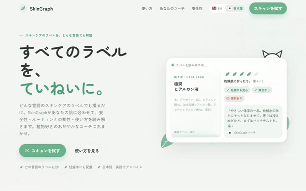
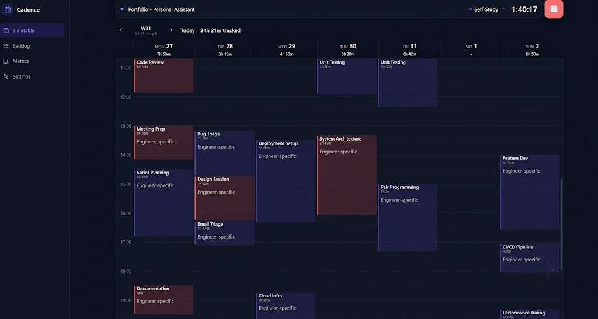

<h3 align="center">Hola, this is David's repo🚀</h3>

  
  
  
  

AI Platform/MLOps engineer in Tokyo, about 10 years in. Currently deep in LLMOps, RAG and multi-agent systems. Spanish by blood, Tokyo resident by choice, bilingual in Japanese (N1) because quitting wasn't an option.

My favorite proverb: "If you want to go fast, go alone. If you want to go far, go together". Strong teams always win.

When I'm not shipping RAG pipelines, I'm camping, at the piano, or being supervised by two kittens who consider my keyboard theirs.

### Project #1: [SkinGraph](https://github.com/dvallslanaquera/skingraph)

Skincare products are becoming obiquitous, but their use comes with risk for people with some skin conditions or pregnant women. Checking whether a product is safe to use or not when some products are not transparent about the composition of the products and the urge of products that are not translated to English coming for the Korean market, is becoming more difficult than ever. 

SkinGraph can take a picture from the front or back of any product in any language, and perform a safety check along with a recommendation based on the preferences of the user. Built with LangGraph, it uses a tiered logic that decides what's the best VLM to use based on the nature of the input image. The extracted ingredients are grounded against a Qdrant registry using multilingual-e5-small embeddings to normalize the results and ensure the are not hallucinations. 

  

### Project #2: [Cadence](https://github.com/dvallslanaquera/cadence)

Most time tracking apps are paywalled dashboards that measure you instead of helping you. Cadence goes the other way: a local, no-login time tracker that stays out of the way. Start a timer, tag it, stop it. Your data stays on your machine, and the reports are there when you need them.

  

### GitHub Contributions

  

